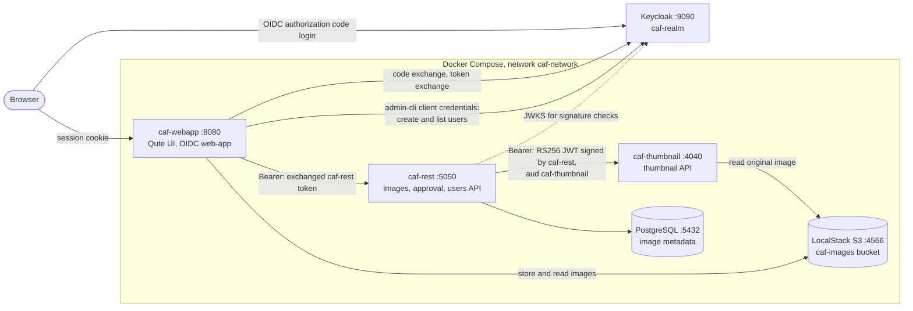
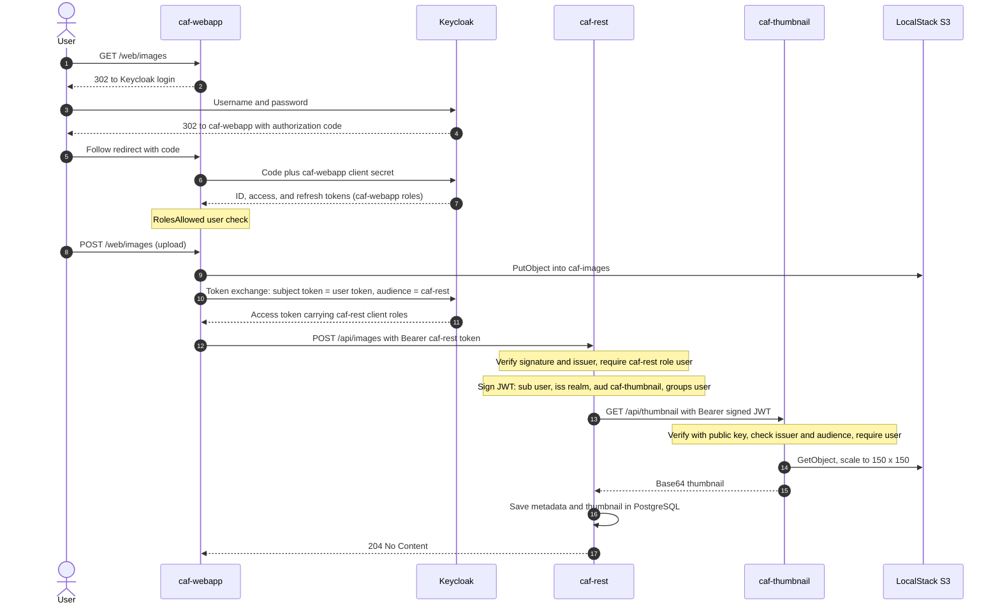

# Microservices Security with Keycloak: OAuth 2.0, OIDC, Token Exchange, and JWT

This project was built in three iterations. v1 set up an AWS VPC deployment network with no SSH access and KMS-encrypted secrets. v2 and v3 secured CAF, a Quarkus image-sharing app, first as a monolith with Keycloak OIDC login, role checks, and ownership checks, then as three microservices where every hop carries a credential issued for the service it calls: the webapp exchanges the user's token for a caf-rest token through Keycloak (RFC 8693), and caf-rest calls the thumbnail service with a JWT it signs itself.

## Demo

<!-- Replace each REPLACE_WITH_... placeholder with the unlisted YouTube link. -->

| Video | What it shows |
|---|---|
| [v1: AWS foundation](https://youtu.be/REPLACE_WITH_V1_VIDEO_ID) | Subnets, route tables, security groups, IAM instance profiles, SSM VPC endpoints, Session Manager access with no SSH port open, and both containers starting with credentials pulled from Parameter Store |
| [v2: CAF with Keycloak](https://youtu.be/REPLACE_WITH_V2_VIDEO_ID) | Keycloak login, an admin adding users through the app, image upload and approval, comments, and 403 responses for missing roles and for non-owners |
| [v3: Microservices](https://youtu.be/REPLACE_WITH_V3_VIDEO_ID) | Keycloak LOGIN and TOKEN_EXCHANGE events, OIDC trace logs across the three services, curl calls to caf-rest and caf-thumbnail with and without tokens, and the stack running in Docker Compose |

## Architecture



Login, token exchange, and the service-to-service JWT during an image upload:



## Security features

1. **OIDC authorization code login.** caf-webapp is a confidential Keycloak client in Quarkus `web-app` mode. Quarkus handles the redirect, code exchange, and session, so the client secret stays on the server and the browser only holds an encrypted session cookie.
2. **Role-based access control from token claims.** `@RolesAllowed` restricts image pages to `user`, the approval queue to `approver`, and adding users to `admin`. RBAC lives in the app while Keycloak only assigns roles, which keeps each rule next to the endpoint it protects.
3. **Ownership checks that roles cannot express.** Deleting an image or a comment returns 403 unless the caller uploaded the image, and a comment delete also checks that the comment belongs to that image. This closes the insecure direct object reference that role checks alone leave open.
4. **Least-privilege user management.** The webapp creates and lists users with the Keycloak admin client, authenticating as the master realm `admin-cli` service account through the client credentials grant. No admin username or password is configured in the app.
5. **Token exchange between tiers.** REST clients annotated with `@AccessToken` trade the user's caf-webapp token for a token with audience `caf-rest` before every call. caf-rest runs as an OIDC `service` and authorizes on its own client roles (`resource_access/caf-rest/roles`), so the webapp's permissions and the API's permissions are managed separately.
6. **Signed service-to-service JWT.** caf-rest signs an RS256 JWT for each thumbnail request with subject, issuer, audience `caf-thumbnail`, and a `groups` claim. caf-thumbnail holds only the public key and rejects tokens with the wrong signature, issuer, or audience before `@RolesAllowed("user")` runs.
7. **Secret delivery outside the image.** Compose mounts the signing key as a Docker secret at `/run/secrets/caf_rest_jwt_key`. Passwords and client secrets come from environment variables, and none of them are in this repo.
8. **Audit trail.** The realm records LOGIN and TOKEN_EXCHANGE events, which the v3 demo uses to show each exchange.
9. **Private network deployment on AWS (v1).** Security groups limited to the ports each tier needs, no inbound SSH, Session Manager over VPC endpoints, and separate KMS keys so the web tier cannot decrypt the database admin password. See [infra/aws-vpc](infra/aws-vpc/README.md).

## Tech stack

| Area | Tools |
|---|---|
| Language and framework | Java 21, Quarkus 3.31 (REST, Qute, Hibernate ORM, REST Client) |
| Identity | Keycloak 26.5, Quarkus OIDC, OIDC Client with token propagation, Keycloak Admin Client |
| Service tokens | SmallRye JWT (build and verify), MicroProfile JWT |
| Data | PostgreSQL, LocalStack S3 through the Quarkus Amazon S3 extension |
| Runtime | Docker, Docker Compose, Quarkus container image build, SmallRye Health |
| Cloud (v1) | AWS VPC, EC2, Systems Manager (Session Manager, Parameter Store), KMS, IAM, EBS |
| Build | Maven |

## Project progression

| Tag | Iteration | What it added |
|---|---|---|
| [`v1-aws-foundation`](https://github.com/tyler-hackett/microservices-security-keycloak-oauth2/tree/v1-aws-foundation) | AWS deployment foundation | AWS VPC with public and private subnets, SSM access without SSH, KMS-encrypted Parameter Store secrets, and scripts that launch the database and web containers with those secrets |
| [`v2-oidc-rbac`](https://github.com/tyler-hackett/microservices-security-keycloak-oauth2/tree/v2-oidc-rbac) | Identity and access control | CAF monolith with Keycloak OIDC login, `@RolesAllowed` RBAC, owner-only deletes, Keycloak admin client user management, S3 image storage, and the caf-realm export |
| [`v3-microservices`](https://github.com/tyler-hackett/microservices-security-keycloak-oauth2/tree/v3-microservices) | Microservices | Split into caf-webapp, caf-rest, and caf-thumbnail; token exchange from webapp to caf-rest; signed JWT from caf-rest to caf-thumbnail; Docker Compose deployment with a Docker secret |

## Repository structure

```
.
├── caf-root/pom.xml          Maven parent; modules are siblings
├── caf-domain/               JPA entities and DAO
├── caf-dto/                  DTOs shared by webapp and caf-rest
├── caf-service-client/       Service interfaces and role names
├── caf-service/              UserService (Keycloak admin client), REST clients for caf-rest
├── caf-webapp/               Web UI, OIDC login, RBAC and ownership checks
├── caf-rest/                 Images, approval, and users API; JWT signing
├── caf-thumbnail/            Thumbnail API; JWT verification
├── caf-database/             Dockerfile and init script for the caf/caf-database image
├── keycloak/caf-realm.json   Realm export (client secrets masked by Keycloak)
├── infra/aws-vpc/            v1 AWS launch scripts and write-up
├── docs/keycloak-setup.md    Realm, client, and role configuration
├── compose.yaml
└── .env.example
```

## Running locally

The stack targets a local development machine. Keycloak runs outside Compose, the database image and the JWT key pair are built locally, and the S3 bucket is created by hand.

Prerequisites: Docker with Compose, JDK 21, Maven 3.9+, OpenSSL, and the AWS CLI.

Keycloak settings that the realm import does not cover (client secrets, the `admin-cli` service account, users) are in [docs/keycloak-setup.md](docs/keycloak-setup.md).

```bash
cp .env.example .env              # fill in values; client secrets come from Keycloak in step 2
set -a; source .env; set +a       # export them to this shell

# 1. Network and Keycloak, importing caf-realm on first start
docker network create caf-network
docker run -d --name keycloak --network caf-network -p 9090:8080 \
  -e KC_HOSTNAME="$KC_HOSTNAME" -e KC_HOSTNAME_PORT=9090 \
  -e KC_BOOTSTRAP_ADMIN_USERNAME="$KC_BOOTSTRAP_ADMIN_USERNAME" \
  -e KC_BOOTSTRAP_ADMIN_PASSWORD="$KC_BOOTSTRAP_ADMIN_PASSWORD" \
  -v "$PWD/keycloak:/opt/keycloak/data/import:ro" \
  quay.io/keycloak/keycloak:26.5.5 start-dev --import-realm

# 2. In the admin console (http://<KC_HOSTNAME>:9090), follow docs/keycloak-setup.md:
#    regenerate the client secrets, enable the admin-cli service account, create users.
#    Put the three secrets in .env, then run: set -a; source .env; set +a

# 3. RSA key pair for caf-rest -> caf-thumbnail (both files are gitignored)
openssl genrsa -out baseKey.pem 2048
openssl pkcs8 -topk8 -nocrypt -in baseKey.pem -out privateKey.pem
openssl rsa -in baseKey.pem -pubout -out publicKey.pem
cp publicKey.pem caf-thumbnail/src/main/resources/

# 4. Images: caf-database from its Dockerfile, the three services through Maven
docker build -t caf/caf-database caf-database/
mvn -f caf-root/pom.xml clean package -DskipTests

# 5. Start the stack and create the bucket
docker compose up -d
aws --endpoint-url=http://localhost:4566 --region us-east-1 s3 mb s3://caf-images
```

Open http://localhost:8080. Compose publishes caf-webapp on 8080, caf-rest on 5050, caf-thumbnail on 4040, PostgreSQL on 5432, and LocalStack on 4566. `privateKey.pem` stays in the repo root, where `compose.yaml` reads it as the `caf_rest_jwt_key` secret.

v2 and v3 were developed in Quarkus dev mode. To run that way, start only `caf-database` and `s3local` with Compose, copy `privateKey.pem` into `caf-rest/src/main/resources/` and `caf-service/src/main/resources/`, run `mvn -f caf-root/pom.xml install -DskipTests`, then run `mvn quarkus:dev` in `caf-thumbnail` (port 4040), `caf-rest` (5050), and `caf-webapp` (8080) with the same environment variables exported.

## Configuration

All secrets are environment variables; see [.env.example](.env.example) for the full list with placeholders.

| Variable | Used by | Purpose |
|---|---|---|
| `KC_HOSTNAME` | Keycloak, all services, `compose.yaml` | Host in every token issuer URL; must match everywhere |
| `KC_BOOTSTRAP_ADMIN_USERNAME`, `KC_BOOTSTRAP_ADMIN_PASSWORD` | Keycloak container | Admin console login |
| `POSTGRES_PASSWORD` | caf-database | Superuser password for first initialization |
| `DATABASE_PASSWORD` | caf-database, caf-rest | Password for the `cafuser` account |
| `AWS_ACCESS_KEY_ID`, `AWS_SECRET_ACCESS_KEY` | caf-webapp, caf-thumbnail, AWS CLI | LocalStack S3 credentials |
| `CAF_WEBAPP_CLIENT_SECRET` | caf-webapp | OIDC login and token exchange |
| `CAF_REST_CLIENT_SECRET` | caf-rest | OIDC service client |
| `KEYCLOAK_ADMIN_CLIENT_SECRET` | caf-webapp | `admin-cli` service account for user management |

Key files, generated locally and gitignored: `privateKey.pem` (Compose secret `caf_rest_jwt_key`) and `publicKey.pem` (loaded from the caf-thumbnail classpath).

## Test users and trying the app

The realm export contains no user accounts, so create them in the admin console under caf-realm > Users. Set a password on the Credentials tab and assign client roles on the Role mapping tab:

| Example user | caf-webapp roles | caf-rest roles | Purpose |
|---|---|---|---|
| `admin1` | `admin`, `user` | `user` | Adds users through the app |
| `approver1` | `approver`, `user` | `approver`, `user` | Approves uploaded images |

Users added through the app get the caf-webapp `user` role automatically. Give them the caf-rest `user` role in the console as well; without it, caf-rest answers 403 even after a successful token exchange.

Things to try:

1. Log in as `admin1` and add a user at `/web/users`.
2. Log in as that user and upload an image at `/web/images`. It stays hidden until approved.
3. Log in as `approver1` and approve it at `/web/approval`.
4. As a different user, comment on the image, then try to delete the image or that comment: both return 403, because only the image owner can delete either one.
5. Open `/web/approval` as a plain user: 403.
6. In the admin console, caf-realm > Events lists the LOGIN and TOKEN_EXCHANGE events.

## Key takeaways

<!-- REVIEW: drafted from the code and configuration. Edit to match your own experience before publishing. -->

- **Every component has to agree on the issuer.** Inside Docker, `localhost` means the container itself. Keycloak's `KC_HOSTNAME`, each service's auth server URL, and the issuer in the JWT caf-rest signs all had to use the same host address the browser uses, or token exchange and verification failed on an issuer mismatch.
- **Roles belong to clients.** Keycloak puts client roles under `resource_access.<client>.roles`. caf-rest needed its own role claim path and its own role assignments, so a user holding only caf-webapp roles gets 403 from caf-rest after a successful exchange.
- **RBAC cannot express ownership.** `@RolesAllowed` decides whether a user may delete images, never whether they may delete this image. The owner check and the comment-to-image check had to be written in the controller, which is exactly where insecure direct object reference bugs appear when those checks are missing.
- **Two token types in one request.** The webapp-to-caf-rest hop uses a Keycloak-issued token, while caf-rest to caf-thumbnail uses a JWT that caf-rest signs. caf-thumbnail trusts a public key instead of Keycloak, so distributing the key pair (Docker secret for the private key, classpath for the public key) is part of the security design.
- **Dev mode hides configuration gaps.** Values under the `%dev` profile do not exist in the containers. Moving to Compose meant passing every client secret and host setting as an environment variable, and the webapp would not start until its OIDC client secret was supplied.
- **No SSH at all is practical.** In v1, Session Manager over VPC interface endpoints replaced both port 22 and a bastion host, and separate KMS keys per parameter kept the web tier from decrypting the database admin password.

## Known issues and hardening ideas

- `ImageService.generateAuthToken()` in caf-service signs a JWT on every call to caf-rest and passes it as the `Authorization` header. caf-rest only accepts Keycloak-signed tokens, so the exchanged token that `@AccessToken` supplies is the one that authorizes the call and the self-signed token goes unused. The method also makes the webapp load the private key that caf-thumbnail trusts, and `compose.yaml` does not mount that key into caf-webapp. The fix is to delete the method and the key settings from caf-service so only caf-rest holds the key.
- In dev mode the private key is read from the classpath, so building images while a copy sits in `src/main/resources` packages the key into the jar. Build container images without it.
- caf-rest does not set `quarkus.oidc.token.audience`, so it relies on role claims alone. Requiring audience `caf-rest` and turning off full scope on the caf-webapp client would stop the webapp's own token from being accepted downstream.
- Service-to-service calls are plain HTTP inside the Docker network (the `tls-disabled` TLS configuration), and every service port is published to the host for testing.

## Attribution

The module scaffolding, domain model, DTOs, Qute templates and static assets, Quarkus Dockerfiles, `ThumbnailService`, the `caf-database` Dockerfile and init script, the v3 REST client interfaces, and the template that `infra/aws-vpc/run-chat-container.sh` follows came from a provided starter codebase. I built the security implementation on top of it: the access control, ownership checks, user management, and JWT code in the controllers, `UserService`, and the caf-rest and caf-thumbnail resources; all Quarkus security, S3, and datasource configuration; the Keycloak realm; `compose.yaml`; and the AWS setup.
