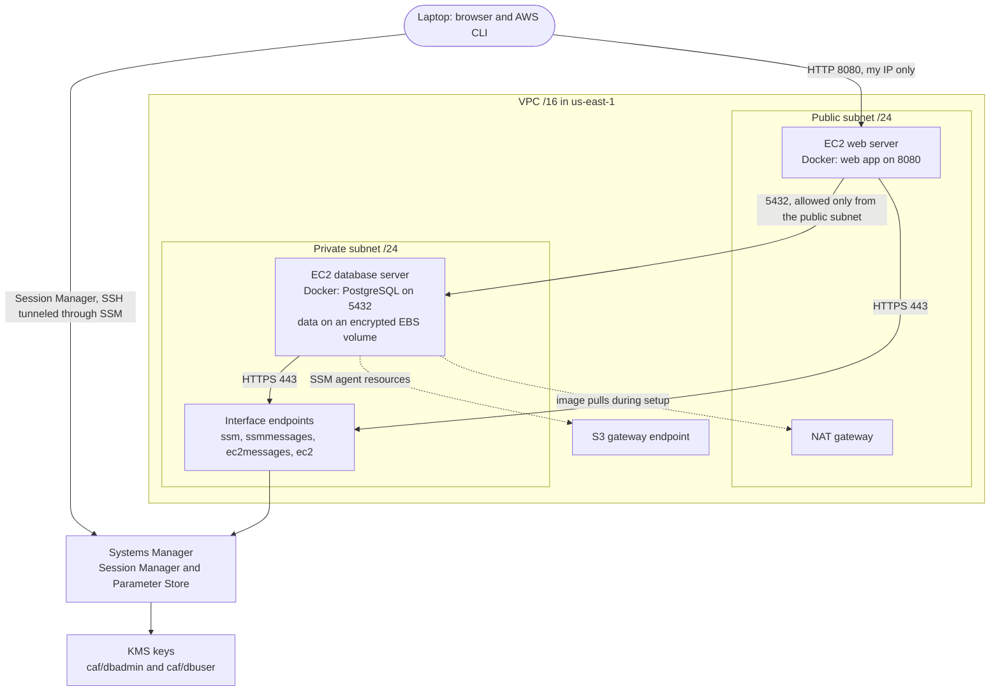

# v1: AWS VPC deployment foundation

[Demo video](https://youtu.be/REPLACE_WITH_V1_VIDEO_ID)

v1 set up the AWS network used to host an application: a web server in a public subnet, PostgreSQL in a private subnet, and no SSH access anywhere. The application deployed here was a small chat demo app from the starter codebase; CAF itself runs locally in Docker Compose in v2 and v3.

## Security decisions

- **No port 22.** No security group allows SSH. Instances are managed through Session Manager, which authorizes each session with IAM. Copying files to the web server uses SSH tunneled through a Session Manager session addressed by instance ID.
- **Private database.** The database instance has no public IP. Its security group accepts only 5432 from the public subnet. The SSM agent reaches Systems Manager through VPC interface endpoints, so the private subnet does not need a path to the internet once setup is done.
- **Secrets in Parameter Store under separate KMS keys.** The database admin password and the application user password are SecureStrings encrypted with different KMS keys. The database instance profile can decrypt both. The web server instance profile can decrypt only the application user key and has an explicit Deny on the database admin parameters.
- **Scoped CLI access.** Local AWS CLI work used an IAM user whose policy is limited to Session Manager, SSH over Session Manager, and decryption with the two keys, instead of the root account.
- **Credentials only at container start.** The scripts below read parameters at launch, write them to a temporary env file for `docker run`, and delete the file.

## Scripts

| Script | Runs on | What it does |
|---|---|---|
| [run-db-container.sh](run-db-container.sh) | Database instance | Reads the admin password, username, and database name from Parameter Store (decrypting the password), starts PostgreSQL with its data directory on the EBS volume, then removes the env file |
| [run-chat-container.sh](run-chat-container.sh) | Web server instance | Reads the application user password, username, database name, and database host from Parameter Store, builds the JDBC URL, starts the web container, then removes the env file |

`run-chat-container.sh` follows a launch script template from the starter codebase, filled in with this deployment's parameter names. `run-db-container.sh` is adapted to run the stock PostgreSQL image.
